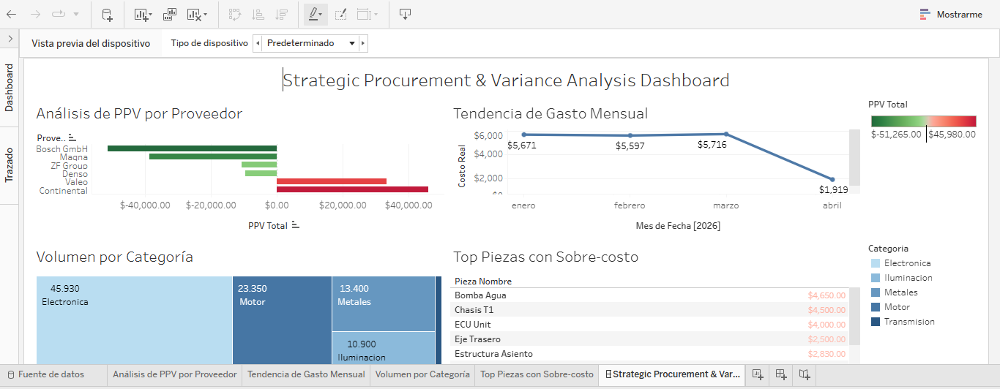

# 📊 Bosch Strategic Procurement Dashboard

## 🎯 Objetivo del Proyecto
Este dashboard fue diseñado para la **Lic. Daniela** y el equipo de Compras de Bosch. El objetivo es monitorear en tiempo real las variaciones de precio (PPV) para identificar ahorros y riesgos financieros en la cadena de suministro.

## 📈 Dashboard Interactivo

> **🔗 [Se adjunta archivo de Tableau]**

---

## 💡 Hallazgos y Preguntas de Negocio Resueltas
1. **Desempeño de Proveedores:** Identificación inmediata de proveedores con PPV positivo (pérdida) y negativo (ahorro).
2. **Tendencia Mensual:** Análisis de estabilidad de precios durante el primer cuatrimestre.
3. **Piezas Críticas:** Listado de componentes con mayor sobre-costo para renegociación urgente (ej. Faro LED y Pantalla Infotainment).

## 🛠️ Herramientas utilizadas
* **Tableau Public** (Visualización de datos e interactividad)
* **Excel** (Limpieza y estructuración de base de datos de compras)
